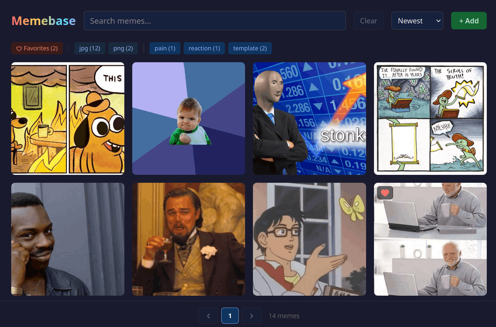

# Memebase

A self-hosted, web-based home for your memes. Upload, tag, search, and hoard your collection - with optional AI that names and tags them for you.

[](https://github.com/hberg539/memebase/actions/workflows/test.yml)
[](https://www.python.org)
[](https://flask.palletsprojects.com)
[](LICENSE)



## What it does

- **Upload** - Drag-and-drop or paste a URL. Duplicates are caught automatically
- **Search & filter** - Full-text search with filters for extension, tag, and favorites
- **AI auto-detect** - Let a vision model generate filenames, descriptions, and tags for you
- **Bulk operations** - Select a bunch of memes at once for tagging, auto-detect, or deleting
- **Copy & download** - One click to copy a meme to your clipboard or download it
- **Self-contained** - Everything lives in a single `./data` folder. Easy to back up, easy to move

**Supported formats:** PNG, JPG, JPEG, GIF, WEBP, WEBM, MP4

## Getting started

### Docker (recommended)

```bash
mkdir memebase && cd memebase
mkdir data

# Create docker-compose.yml
docker-compose up -d
```

`docker-compose.yml`:

```yaml
services:
  memebase:
    image: ghcr.io/hberg539/memebase:latest
    restart: unless-stopped
    ports:
      - "5000:5000"
    volumes:
      - ./data:/app/data
```

That's it. Open [http://localhost:5000](http://localhost:5000) and start dumping memes.

### Local development

Requires [uv](https://docs.astral.sh/uv/):

```bash
git clone https://github.com/hberg539/memebase.git
cd memebase
uv run main.py
```

Then open [http://localhost:5000](http://localhost:5000).

## Configuration

On first run, `config.default.toml` gets copied to `./data/config.toml`. Edit that file to tweak things.

| Key | Default | What it does |
|-----|---------|--------------|
| `grid.layout` | `"grid"` | Layout mode: `"grid"` (uniform squares) or `"masonry"` (natural aspect ratios) |
| `grid.thumbnail_size` | `220` | Card width in pixels |
| `grid.per_page` | `"auto"` | Memes per page: `"auto"` (fill viewport) or a number |
| `ai.enabled` | `false` | Turn the AI auto-detect feature on or off |
| `ai.model` | `"anthropic/claude-sonnet-4-5-20250929"` | Any LiteLLM-compatible model string (see below) |
| `ai.parallel` | `3` | Max parallel requests during bulk auto-detect |
| `ai.prompt` | *(see config.toml)* | The prompt sent to the vision model - customize it to change the output style |

## AI

AI features are disabled by default. When enabled, Memebase can use a vision model to automatically generate filenames, descriptions, and tags for your memes - one at a time or in bulk.

### Setup

1. Set `ai.enabled = true` in `./data/config.toml`
2. Pass your API key as an environment variable

For Docker, create a `memebase.env` file next to `docker-compose.yml` and add `env_file` to your service:

```
ANTHROPIC_API_KEY=sk-ant-...
# OPENAI_API_KEY=...
# DEEPSEEK_API_KEY=...
```

```yaml
services:
  memebase:
    image: ghcr.io/hberg539/memebase:latest
    restart: unless-stopped
    ports:
      - "5000:5000"
    volumes:
      - ./data:/app/data
    env_file:
      - memebase.env
```

### Supported models

Memebase uses [LiteLLM](https://docs.litellm.ai/) for model routing, so pretty much any vision model works:

| Provider | Model example | Env var |
|----------|--------------|---------|
| Anthropic | `anthropic/claude-sonnet-4-5-20250929` | `ANTHROPIC_API_KEY` |
| OpenAI | `openai/gpt-4o` | `OPENAI_API_KEY` |
| DeepSeek | `deepseek/deepseek-chat` | `DEEPSEEK_API_KEY` |
| Ollama | `ollama/llama3.2-vision` | (local, no key needed) |

Set the `model` field in `./data/config.toml` and pass the matching API key as an environment variable.

## Data storage

Everything lives in `./data`:

```
data/
  memes.db       # SQLite database
  config.toml    # Your configuration
  memes/         # Uploaded meme files
```

## Hotkeys

| Key | Where | What it does |
|-----|-------|--------------|
| `Shift` + click | Grid | Select multiple memes |
| `Escape` | Grid | Clear current selection |
| `Enter` | Meme dialog | Save changes |
| `F` | Meme dialog | Toggle favorite |

## License

MIT

## AI disclaimer

This project was built with heavy use of LLM-assisted development. The codebase is reviewed, directed, and maintained by a human developer. LLMs were used as a tool to speed things up, not as a replacement for engineering judgment. Use at your own risk.
